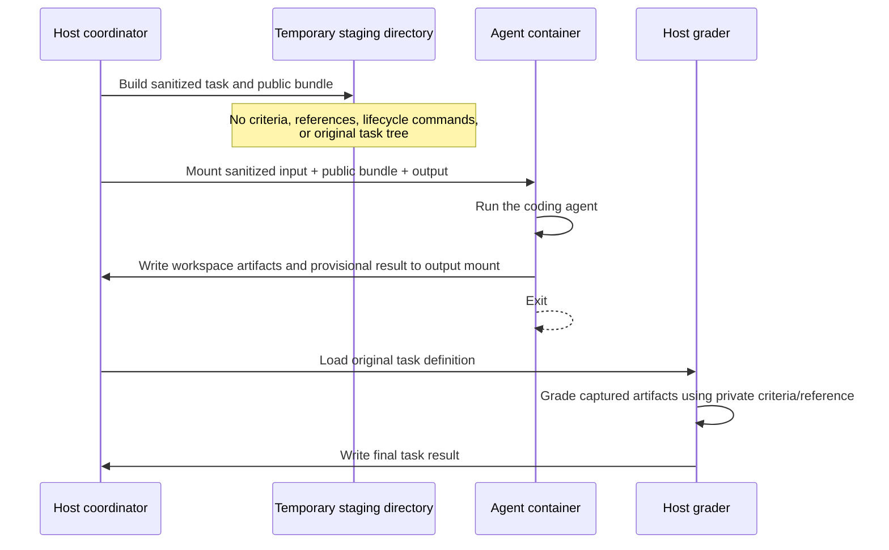

# Agent / Grader Isolation Architecture

This document describes the two local changes that separate evaluated agents
from private grading material.

1. **Base isolation change**: the Docker agent receives a sanitized task, then
   the host grades the captured workspace after the container exits.
2. **Public-input bundle change**: plugins and template sources are copied into
   an explicit allowlisted bundle instead of mounting their original host
   directories into the container.

The result is a simple rule: **the agent gets only its prompt and declared
public inputs; the host retains criteria, references, verifier scripts, and
the original test tree.**

## Before

The original Docker path used one task directory for both execution and
grading. The container could read the complete task YAML and the source task
directory, including adjacent grading assets.

```text
Host test directory
├── task.yaml                 # prompt + criteria
├── RESOLUTION.md             # reference answer
├── check_result.py           # verifier
├── data/                     # fixture data
└── process/                  # agent input
        │
        └── mounted into the agent container
```

Read-only mounts prevented modifications, but not reads. An agent could still
inspect the criteria, reference answer, or fixtures.

## Current architecture



The host and container communicate only through the existing output mount. The
agent does not send a private-grader request and the grader never mounts the
original test directory into the agent container.

## Agent-side filesystem view

```text
Container
├── /work/input/              # read-only, sanitized task.yaml + context.json
│   ├── task.yaml             # prompt, resolved agent config, neutral marker
│   └── context.json          # execution metadata; no source YAML
├── /work/public/             # read-only, staged allowlisted files only
│   ├── plugins/0/
│   └── templates/0/
└── /work/output/             # writable captured workspace + provisional result

Absent from the container
├── original task directory
├── reference solutions
├── success criteria and judge rubrics
├── verifier scripts
├── protected fixture stores
└── raw plugin/template source directories
```

The sanitized task contains a harmless `file_exists: .` marker because task
validation requires at least one criterion. It is not a real grading rule. The
host replaces the provisional result with the result from the original
criteria after the container exits.

## Public-input bundle

Docker tasks configure the files an agent may receive through
`sandbox.docker.agent_input_patterns`.

```yaml
sandbox:
  docker:
    agent_input_patterns:
      - "skills/uipath-automation-discovery/**"
```

For every local plugin and template source, the runner:

1. Resolves its host path, including `$SKILLS_REPO_PATH` on Windows and POSIX
   hosts.
2. Copies only files matching the configured patterns into a temporary public
   bundle.
3. Rewrites the agent-visible plugin/template path to `/work/public/...`.
4. Mounts the public bundle read-only.
5. Does **not** mount the original source directory.

An empty allowlist copies no external files. This is intentionally fail-closed:
existing tasks must explicitly declare the public skill, fixture, or template
files they need.

## End-to-end example

Consider a skill task that asks the agent to create `report.json` and grades it
with `file_exists` and `json_check` criteria.

```text
Original task on host
├── task.yaml
│   ├── initial_prompt: create report.json
│   └── success_criteria: file_exists + json_check
└── skills/uipath-automation-discovery/
    ├── SKILL.md
    └── tests/                 # not declared public

Staged agent inputs
├── input/task.yaml
│   ├── initial_prompt: create report.json
│   ├── success_criteria: neutral workspace marker
│   └── reference/pre_run/post_run: removed
└── public/plugins/0/
    └── skills/uipath-automation-discovery/
        └── SKILL.md
```

Execution proceeds as follows:

1. The host resolves the original task and retains its complete definition.
2. It generates the staged task and public bundle.
3. The agent container starts with only `/work/input`, `/work/public`, and
   `/work/output` mounted.
4. The agent reads the prompt and `SKILL.md`, then writes `report.json` in its
   workspace.
5. The container exits and the workspace is preserved beneath the host run
   directory.
6. The host loads the original `file_exists` and `json_check` criteria and
   evaluates the captured `report.json`.
7. The host writes the authoritative score and criterion details to `task.json`.

## What remains separate

The base split protects static checks and reference comparisons because they
can inspect captured artifacts without exposing private material to the agent.
Dynamic graders (`run_command`, `uipath_eval`, and `agent_judge`) still need a
dedicated minimal-input grader sandbox before they can be considered fully
isolated from candidate-controlled code. Likewise, lifecycle commands require
an explicit host-side execution path if a task needs them to seed or clean up
external state.

## Local validation

The architecture was validated locally with Podman using two full skills smoke
tests:

- Automation-discovery intake
- UiPath-tasks negative guards

Both runs used the staged public bundle, completed successfully, and were
graded after the agent container exited.
