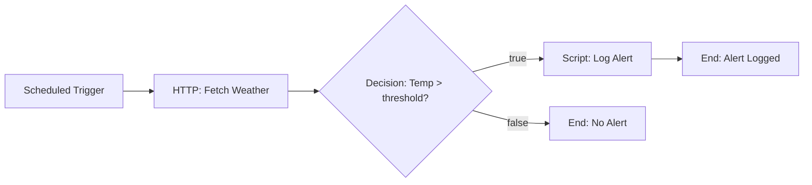

# WeatherAlert — Architectural Plan (Phase 1)

**Status:** APPROVED

## 1. Summary

WeatherAlert is a scheduled flow that monitors weather conditions hourly. It fetches temperature data via HTTP, evaluates it against a threshold, and logs an alert if the temperature is too high.

## 2. Mermaid Diagram

## 3. Node Table

| # | Node ID | Type | Display Label | Notes |
|---|---------|------|---------------|-------|
| 1 | trigger | `core.trigger.scheduled` | Scheduled Trigger | Runs every hour (cron: `0 * * * *`) |
| 2 | fetchWeather | `core.action.http` | Fetch Weather | GET request to weather API |
| 3 | checkTemp | `core.logic.decision` | Check Temperature | Condition: `=js: $vars.fetchWeather.output.temperature > 30` |
| 4 | logAlert | `core.action.script` | Log Alert | Formats alert message |
| 5 | endNoAlert | `core.control.end` | End (No Alert) | Normal completion — no alert needed |
| 6 | endAlert | `core.control.end` | End (Alert Logged) | Completion after alert |

## 4. Edge Table

| # | Source Node | Source Port | Target Node | Target Port | Condition/Label |
|---|-------------|-------------|-------------|-------------|-----------------|
| 1 | trigger | output | fetchWeather | input | — |
| 2 | fetchWeather | success | checkTemp | input | — |
| 3 | checkTemp | true | logAlert | input | Temperature exceeds threshold |
| 4 | checkTemp | false | endNoAlert | input | Temperature normal |
| 5 | logAlert | success | endAlert | input | — |

## 5. Global Variables

| ID | Direction | Type | Default | Purpose |
|----|-----------|------|---------|---------|
| threshold | in | number | 30 | Temperature threshold (Celsius) |
| alertMessage | out | string | "" | Alert message if triggered |

## 6. Open Questions

None — all requirements resolved.
